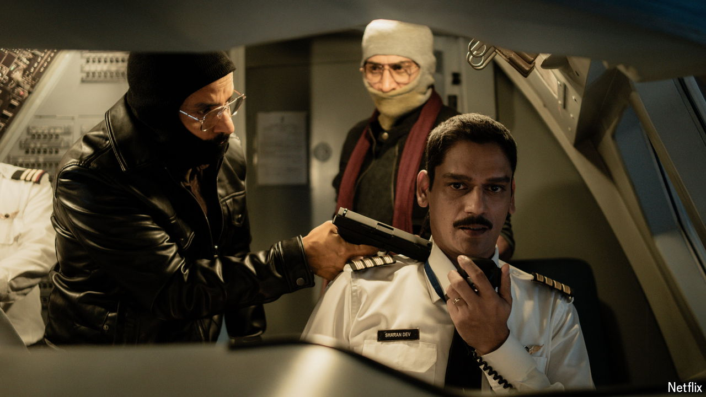

###### Bad boys

# An Indian hijack drama, “IC 814”, dares to portray terrorists as human 

##### By ditching the usual stereotypes it has become a surprise hit on Netflix 

 

> Sep 24th 2024 

Heroes are very, very good, and villains are horrid. This is a basic rule of television and film, especially in India. Typecasting has narrowed and hardened there in recent years. Under , India’s prime minister since 2014 and a promoter of  (an ideology that equates Indianness with Hinduism), Bollywood’s bad guys tend to be Muslim or, better yet, Pakistani. The good guys? They probably work for the Indian government, preferably in uniform. 

