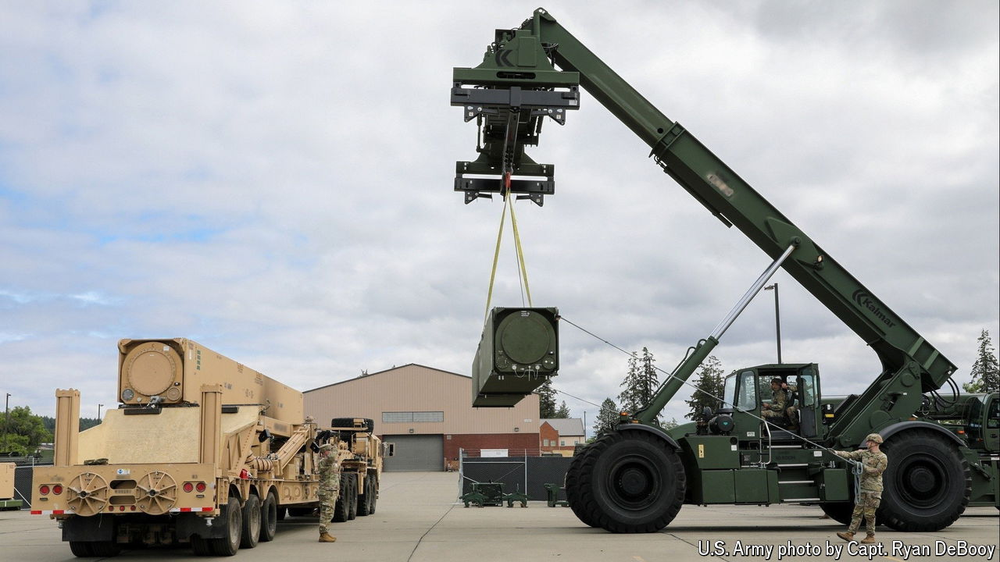

###### OK boomer

# American long-range missiles are coming back to Europe 

##### The German deployment is part of a resurgence of deep-strike weapons 

 

> Sep 24th 2024 

WHEN DONALD TRUMP pulled out of the in 2019 most European states were aghast. They agreed that Russia had cheated on the cold-war pact, which prohibited all ground-based missiles (conventional and nuclear alike) with ranges between 500km and 5,500km. But they thought Mr Trump’s decision reckless and liable to start an arms race. Who in Europe would host such missiles anyway? Pretty much everyone, it turns out. 

