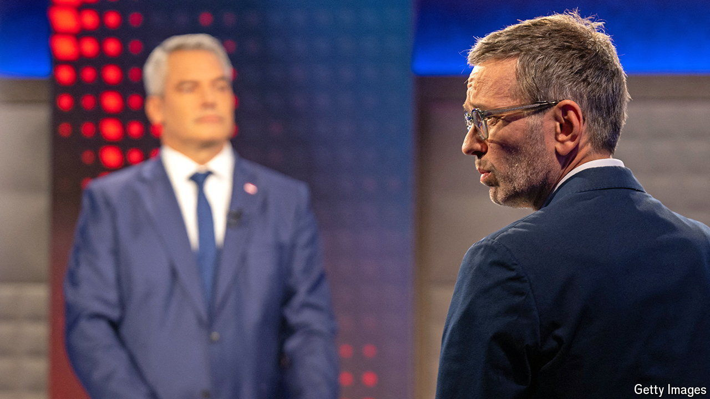

###### Building Fortress Austria

# Austria’s xenophobic right edges towards victory 

##### The Freedom Party is favoured to win the election on September 29th 

 

> Sep 26th 2024 

Austria has been here before. On September 23rd Karl Nehammer, the centre-right chancellor, squared off in a televised debate against Herbert Kickl, the candidate of the hard right. The previous day Mr Kickl had refused to join a forum on a different station that included the leaders of the Social Democrats (SPÖ), the liberal NEOS party and the Greens. None of those parties has a realistic prospect of coming first in the election on September 29th. Mr Kickl, whose Austrian Freedom Party (FPÖ) has its best chance ever to lead the next government, got to face Mr Nehammer one-on-one.

