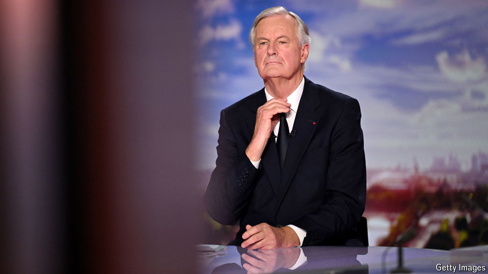

###### French evolution

# France’s new coalition yanks the country a step to the right 

##### Can the prime minister, Michel Barnier, bring stability? 

 

> Sep 23rd 2024 

EUROPE IS A continent of coalition governments, painful to forge and fragile to maintain. Most European politicians are familiar with their challenges. For  new French government, however, which met for its first cabinet meeting on September 23rd, this form of rule is a baffling novelty. For the first time since France’s Fifth Republic was established in 1958, the country is now run by a minority coalition government formed by rival parties that stood against each other at legislative elections. Its survival depends on keeping its lumpy mix of centrists and right-wingers together, and the opposition against it divided.

