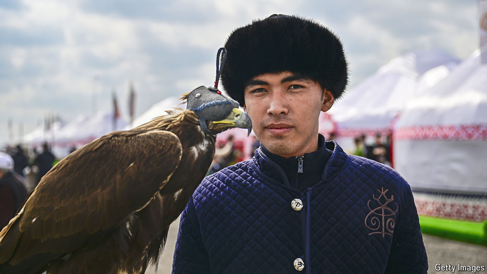

###### Giant steppes

# Turkey and Central Asia are riding together again 

##### The Organisation of Turkic States is a counterweight to Russia 

 

> Sep 26th 2024 

Just outside Astana, Kazakhstan’s capital, a woman whips her horse into a canter, raises a wooden bow and sends three arrows whistling through the air, one after the other, to the delight of spectators. Golden eagles perch on their owners’ shoulders. Nearby, men on horseback fight over a goat carcass (made of rubber, a concession to animal-rights activists) in a game of . Smoke from vats of grilled lamb curls past dozens of white yurts.

