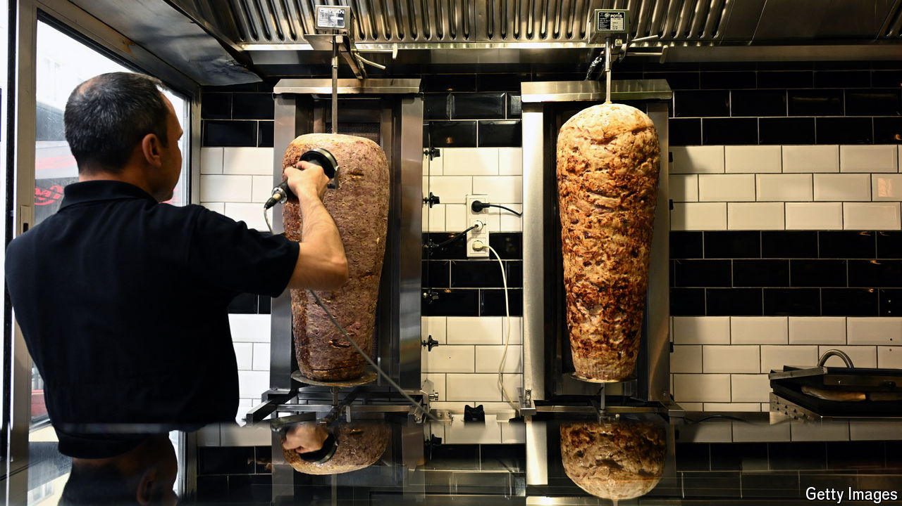

###### A worrying turn

# Turkey wants the EU to regulate the döner kebab 

##### Germans’ version would not qualify, and they are steaming 

 

> Sep 26th 2024 

Turkey and Germany have tussled over issues like Turkey’s human-rights record and protests by Kurds in German cities. Their latest dust-up concerns the döner kebab. Two years ago, Turkey applied to the European Union to have the döner, made from seasoned meat roasted on a vertical spit, protected under the bloc’s “traditional specialty guaranteed” (TSG) scheme. If the EU agrees, the döner would have to be prepared to Turkish specifications, including the type of meat (beef, chicken and lamb are fine, veal and turkey are not) and how it is marinated and sliced.

