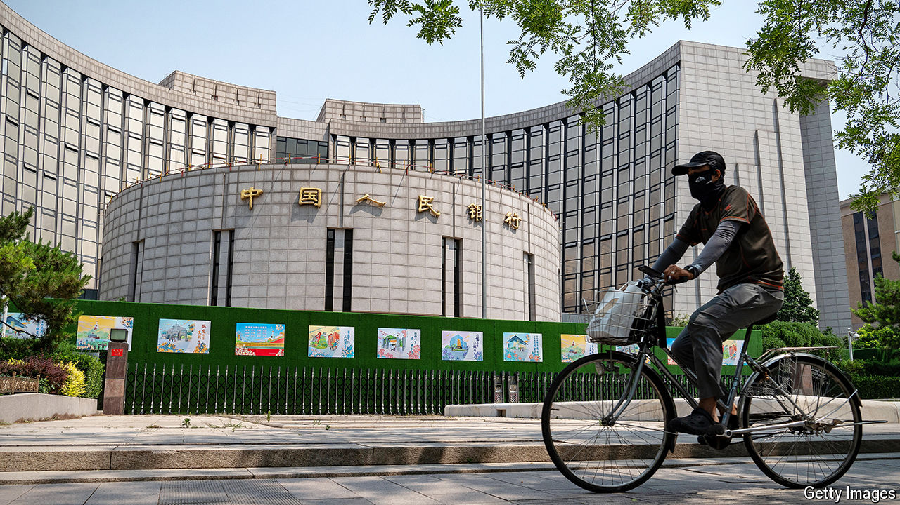

###### No rush

# China’s central bank tries to save the economy—and the stockmarket 

##### But it will need more help from the government 

 

> Sep 24th 2024 

As China’s economy has descended into deflation, the central bank’s lack of urgency has been a source of frustration for many economists. Policymakers at the People’s Bank of China (PBoC) initially expressed confidence that deflation was, so to speak, transitory. When it then persisted, they worried less about falling prices than about the side-effects of fighting them. They were reluctant to ease monetary policy decisively as China’s currency was too weak, banks’ profit margins too slim and bond yields too low.

