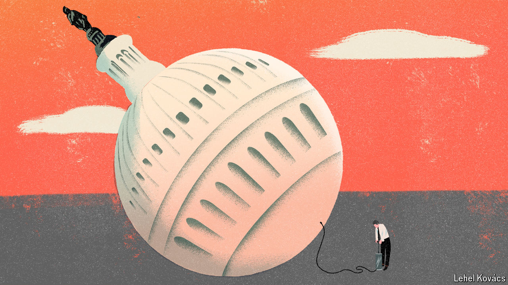

###### Political economy

# Governments are bigger than ever. They are also more useless 

##### Why voters across the rich world are miserable 

 

> Sep 23rd 2024 

You may sense that governments are not as competent as they once were. Upon entering the White House in 2021, President Joe Biden promised to revitalise American infrastructure. In fact, spending on things like roads and rail has fallen. A flagship plan to expand access to fast broadband for rural Americans has so far helped precisely no one. Britain’s  soaks up ever more money, and provides ever worse care. Germany mothballed its  last year, despite uncertain energy supplies. The country’s trains, once a source of national pride, are now often late. 

