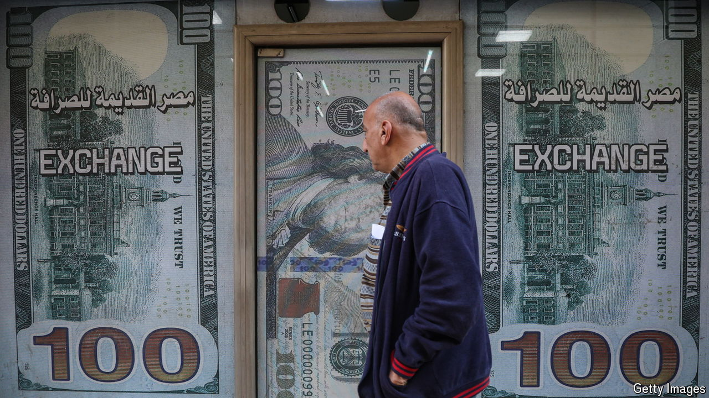

###### International debt

# How lower American interest rates will boost Africa 

##### One of the world’s worst-named financial instruments is newly relevant 

 

> Sep 26th 2024 

Egypt is gearing up to return to international debt markets for the first time in three years. Last week Ahmed Kouchouk, the country’s finance minister, is reported to have told investors that his government is hoping to raise around $3bn in external debt over the coming months. Much of this borrowing will take the form of so-called Eurobonds, one of the world’s worst-named financial instruments. 

