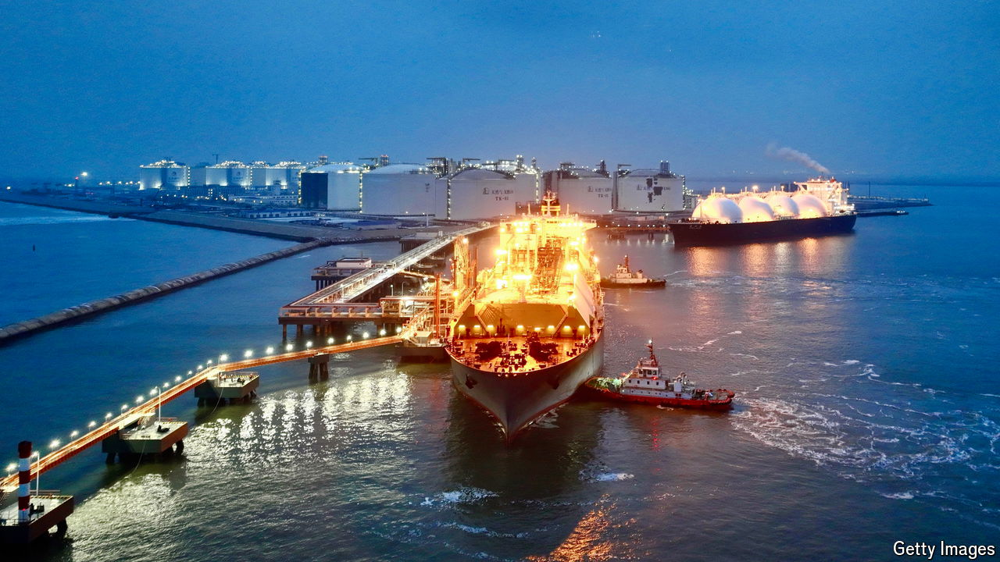

###### Fuel to the fire

# Is the world sleepwalking into another gas crisis? 

##### Prices could once again spike this winter 

 

> Sep 26th 2024 

Gastech, a recent gas-industry jamboree in Houston, was full of enthusiasm. Amid a blizzard of deals by energy ministers and fossil-fuel giants, delegates cheered: their product is set for a starring role in the green transition. Yet there was uncertainty, too. Opprobrium was heaped on President Joe Biden, who has paused permits for American export terminals of liquefied natural gas (LNG). Insiders also worry that the global lng market, which became vital to Europe and Asia after the war in Ukraine began, could soon face its first true test. With demand rising and supply failing to come on stream, a new scramble for gas could be in the offing.

