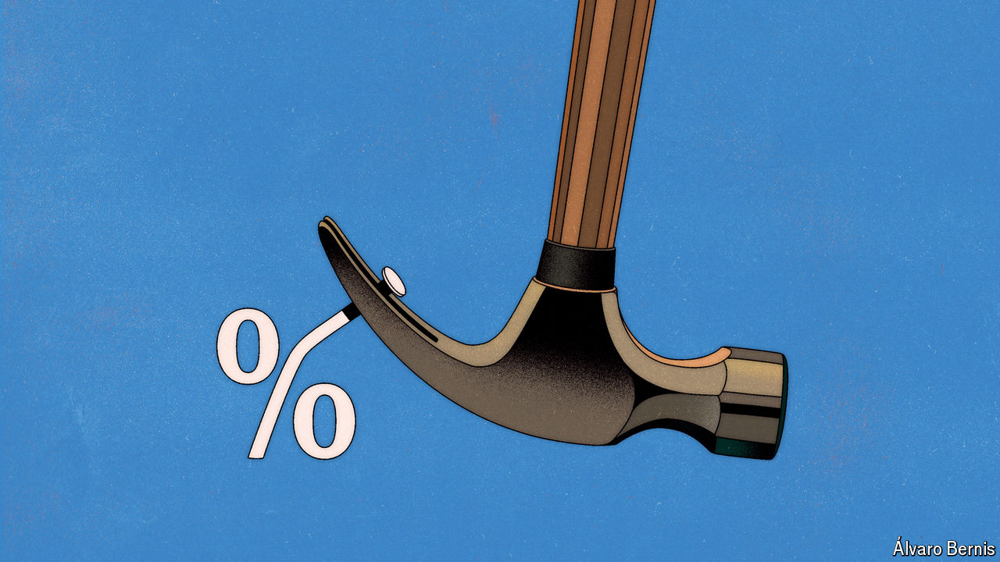

###### Free exchange

# Why the Federal Reserve is split on the future of interest rates 

##### Jerome Powell began with a big cut. What comes next? 

 

> Sep 26th 2024 

A single dissent on the Federal Reserve’s interest-rate committee garnered plenty of attention last week. Understandably so. It marked the first time since 2005 that a Fed governor had opposed a rate decision. Michelle Bowman’s disagreement highlighted concerns that a half-percentage-point cut might be excessive for an economy yet to vanquish inflation. Nevertheless, her 11 other voting colleagues all supported the cut—an indication of near-total unanimity on where the Fed should set rates today. 

