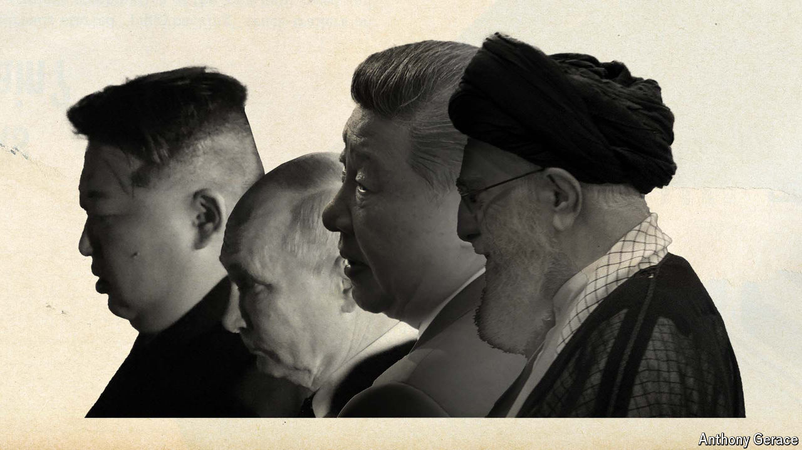

###### Autocratic alliances

# A new “quartet of chaos” threatens America 

##### The rulers of China, Iran, North Korea and Russia are growing worryingly close 

 

> Sep 22nd 2024 

Antony Blinken, America’s secretary of state, was unusually blunt on a recent visit to Europe: “One of the reasons that [Vladimir] Putin is able to continue this aggression is because of the provision of support from the People’s Republic of China,” he said. China was, he added, “the biggest supplier of machine tools, the biggest supplier of microelectronics, all of which are helping Russia sustain its defence industrial base”. American officials are reluctant to discuss details of what they think Russia is giving its friends, but Kurt Campbell, deputy secretary of state, recently said Russia has provided China with submarine, missile and other military technology. Separately, America says that Iran has been busy sending Russia hundreds of short-range ballistic missiles. 

