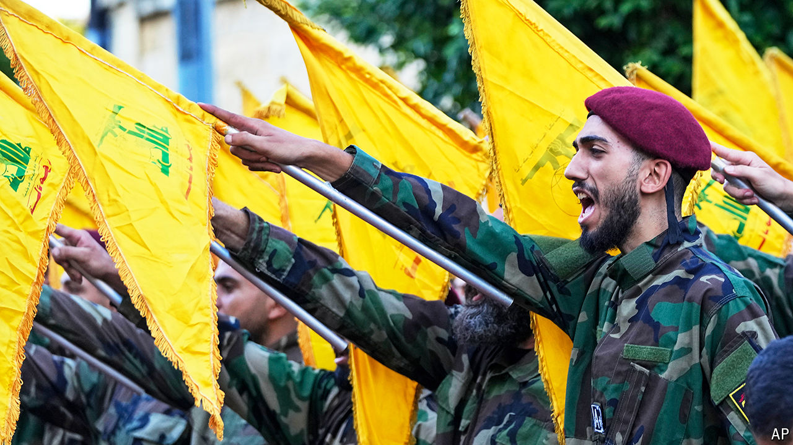

###### Leash the dogs of war

# An Israel-Hizbullah war would be a disaster for both 

##### Both must find a way to step back 

 

> Sep 26th 2024 

Since Hizbullah started firing missiles at Israel on October 8th last year, Israelis, Lebanese and outsiders have dreaded escalation. Now it seems to be happening. The simmering conflict between Israel and , the Shia militia in Lebanon, . More than 500 people were killed in a single day of air strikes as Israel targeted Hizbullah’s commanders and weapons. Tens of thousands of Lebanese have fled from the south. And Hizbullah is hitting back. On September 25th Israel intercepted a ballistic missile heading for Tel Aviv, the first time the militia has targeted Israel’s commercial capital.

