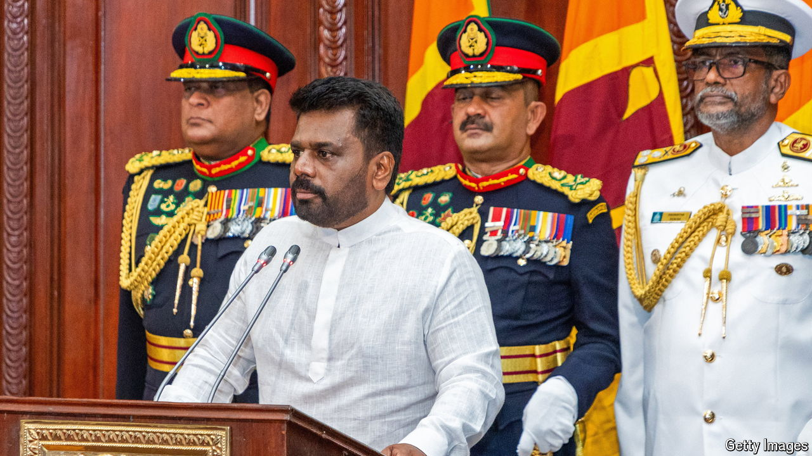

###### Anura Kumara Dissanayake

# How worried should Sri Lanka be about its ex-Marxist president? 

##### He is not as bad as he sounds. But the risk of disappointment is high 

 

> Sep 25th 2024 

The political background of Anura Kumara Dissanayake, who was sworn in as  on September 23rd after winning a run-off election, looks alarming. His party, the Janatha Vimukthi Peramuna (JVP), began as a revolutionary Marxist-Leninist movement that led two unsuccessful but bloody uprisings against the Sri Lankan state in the 1970s and 1980s. Tens of thousands of Sri Lankans were killed or simply “disappeared” in the insurrections and their suppression, which overlapped with a civil war between the government and Tamil rebels.

