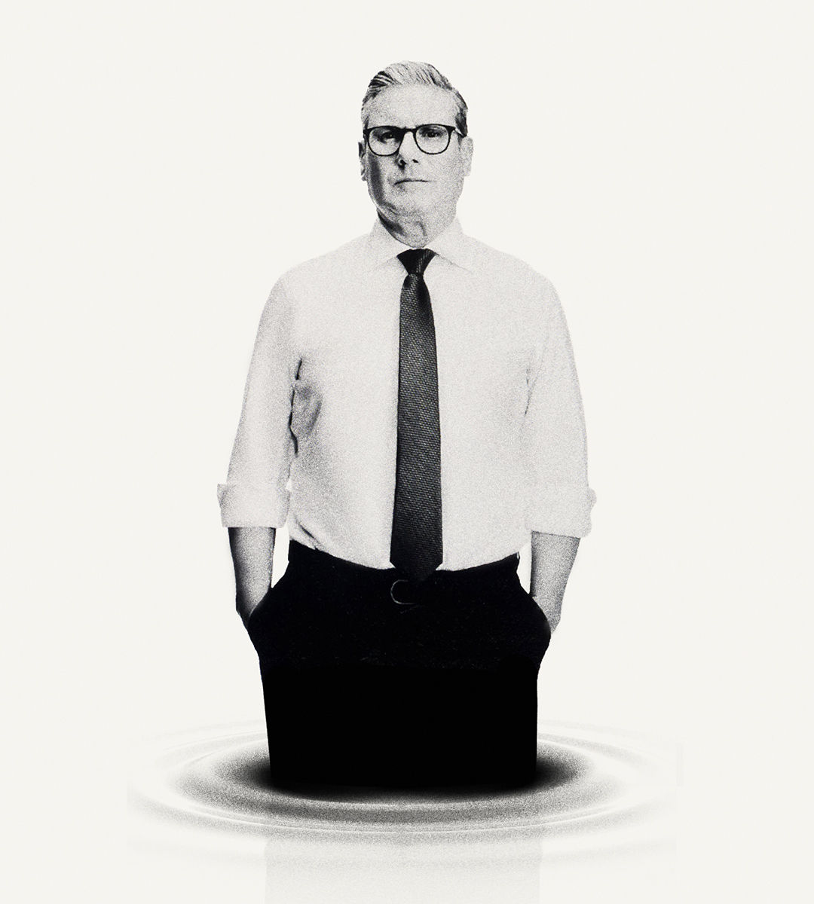

###### Starmer’s woes

# The sinking feeling caused by Labour’s clumsy start 

##### Britain’s new government is paying for the sins of the election campaign 

 

> Sep 26th 2024 

IT IS AS if the honeymoon started to go sour at the airport. Labour won power less than three months ago, yet Sir Keir Starmer’s personal approval ratings now stand below those of Rishi Sunak, the man he replaced as prime minister. Insiders brief about dysfunction at the heart of government. The headlines are all about missteps, most obviously over gifts of glasses, clothing and other freebies for Sir Keir and his wife. The Conservatives suffered their worst defeat in modern history in July; one poll has them just four points behind Labour. 

