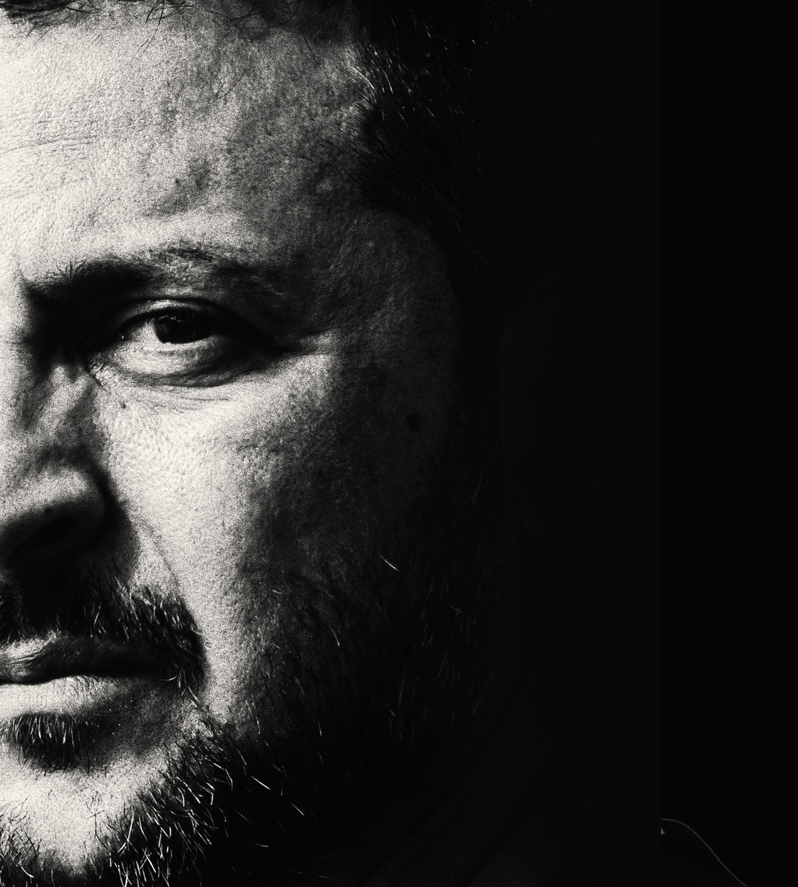

###### Zelensky in Washington

# The war is going badly. Ukraine and its allies must change course 

##### Time for credible war aims—and NATO membership 

 

> Sep 26th 2024 

IF UKRAINE AND its Western backers are to win, they must first have the courage to admit that they are losing. In the past two years Russia and Ukraine have fought a costly war of attrition. That is unsustainable. When  travelled to America to see President Joe Biden this week, he brought a “plan for victory”, expected to contain a fresh call for arms and money. In fact, Ukraine needs something far more ambitious: an urgent change of course.

