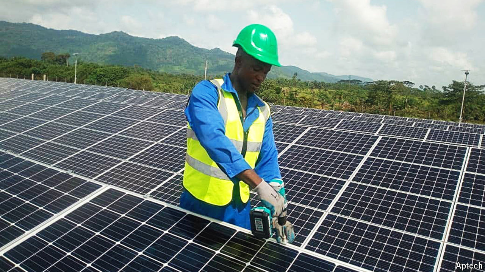

###### Let the sunlight in

# Building an African multinational 

##### What a solar startup reveals about business in the continent’s toughest places 

 

> Sep 26th 2024 

When an eritrean solar salesman called Kidane Tesfamichael arrived in Bangui, the capital of the Central African Republic (CAR), in 2017 he spoke neither French nor Sango, the official languages. He had no means of transport, in a country roughly the size of Texas with only a few hundred kilometres of paved road. And he had no office, so he built himself a single-room bungalow in a car park. To find clients for his firm’s main product, an inverter to turn solar power into electricity, he simply knocked on doors. 

