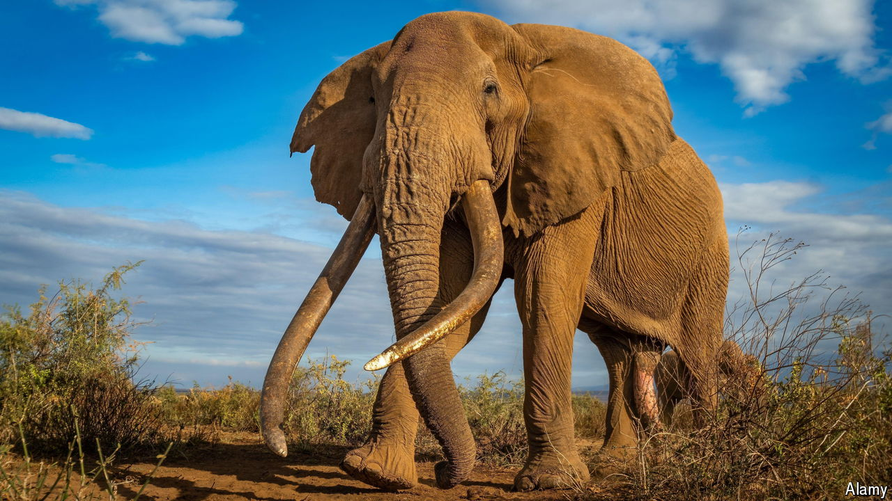

###### Protecting wildlife

# Can shooting some elephants save many others? 

##### Tanzania says yes, Kenya says no 

 

> Sep 26th 2024 

The mighty elephant paws at the foot of an acacia tree, his tusks so long they graze the grass. Snow-capped Mount Kilimanjaro shimmers in the distance. This is the kind of view that each year draws tens of thousands of visitors to Amboseli National Park in Kenya, on the southern border with Tanzania. Craig (pictured), the 51-year-old bull underneath the tree, may be the best-known elephant in the world.

