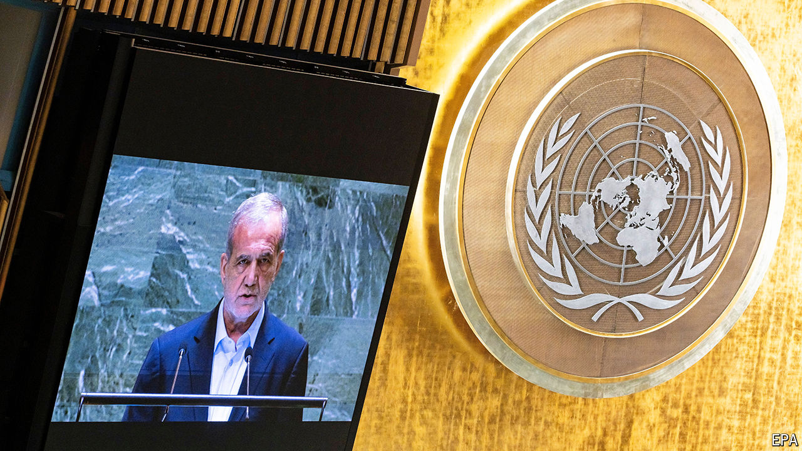

###### Iran’s calculations

# Iran’s damage-limitation efforts may not go to plan 

##### As war with Israel intensifies on two fronts, Iranian presidential hopes for a rapprochement may fade 

 

> Sep 25th 2024 

For a week all eyes have been on Iran and its response to Israel’s pounding of Hizbullah, the Lebanese Shia group that is Iran’s beefiest proxy. But at the UN gathering in New York on September 24th Iran’s freshly minted president, Masoud Pezeshkian, sounded conciliatory, calling for a “new era” and for the nuclear agreement previously negotiated with America and other global powers to be restored. Despite Israel’s battering of Hizbullah, he did not call for “the Zionist regime” to be destroyed. If Israel gave up its weapons, he even said Iran would, too. 

