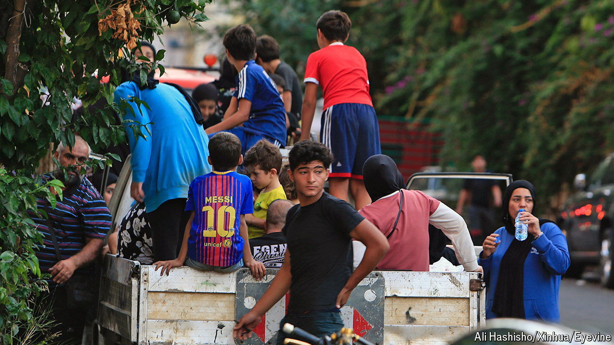

###### The view from Beirut

# The flight from southern Lebanon has been swift 

##### Israel’s attacks have left the Lebanese fearful and suspicious 

 

> Sep 26th 2024 

After almost a year of waiting for war, the exodus from south Lebanon came in a dramatic instant. Tens of thousands of Lebanese grabbed whatever and whoever they could and squeezed ten or more to a car to travel north, fleeing Israeli air strikes. The coastal highway was rammed. Aid agencies say over 200,000 Lebanese have been displaced since October 8th.

