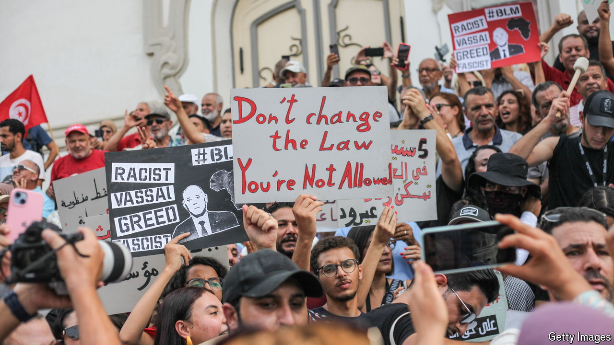

###### Second time as farce

# Tunisia’s strongman president looks set to win another term in office 

##### It helps to put most of your opponents in jail 

 

> Sep 26th 2024 

IN A SENSE, he kept his promises. Five years ago Kais Saied ran for president as an outsider who would overhaul Tunisia’s politics. He has done just that, giving himself powers described by some as a “self-coup” and smothering a nascent democracy. Few Tunisians would say they are better off. Yet on October 6th Mr Saied will stand for re-election in a vote he will surely win.

