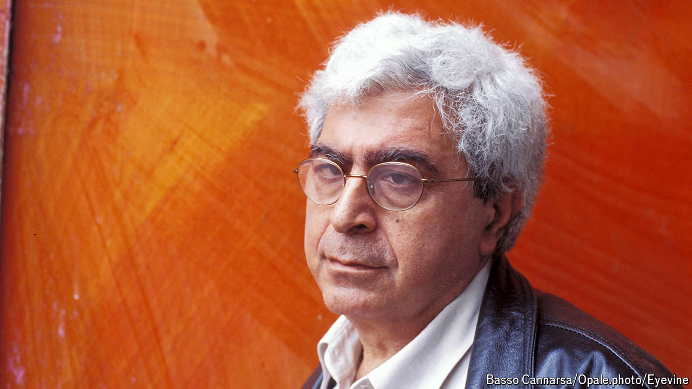

###### The storyteller of Beirut

# Elias Khoury encapsulated the confusions of the Middle East 

##### The Lebanese novelist and activist for Palestinians died on September 15th, aged 76 

 

> Sep 25th 2024 

When she reached her old house, the only one undemolished in the village, Umm Hassan had to sit on the ground for a while. She dared not press the buzzer. When her brother did, a dark-complexioned woman opened it and welcomed them in. She spoke Arabic, but quickly said that she was not an Arab. She was Jewish, an Israeli, and since 1948—the year of the Nakba, the catastrophe, when most Palestinians fled and Jewish migrants moved to the new state of Israel—the house was hers. While she made coffee for them, Umm Hassan noticed that everything was in its old place, even the earthenware water jug. The Jewish woman said she could take it if she wanted to; but Umm Hassan, after picking up the jug, instead handed it back to her. Both women said, “Thank you.”

