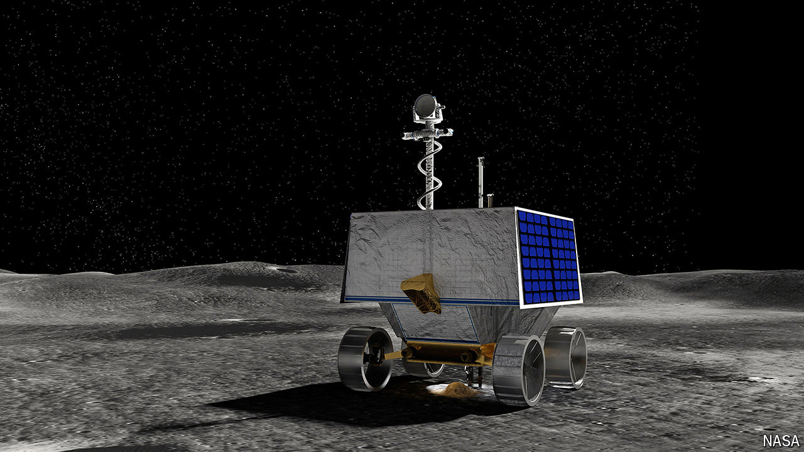

###### VIPER

# NASA is selling a brand-new Moon rover 

##### Never used, one previous owner 

 

> Sep 25th 2024 

NASA HAS big plans for the Moon. By the end of the decade, it wants to send humans back to the lunar surface. Before then, though, it intends to send probes to look for ice at its south pole. This ice carries enormous scientific value. It could shed light on how Earth acquired its liquid water; it is also ripe for conversion into rocket propellant.

