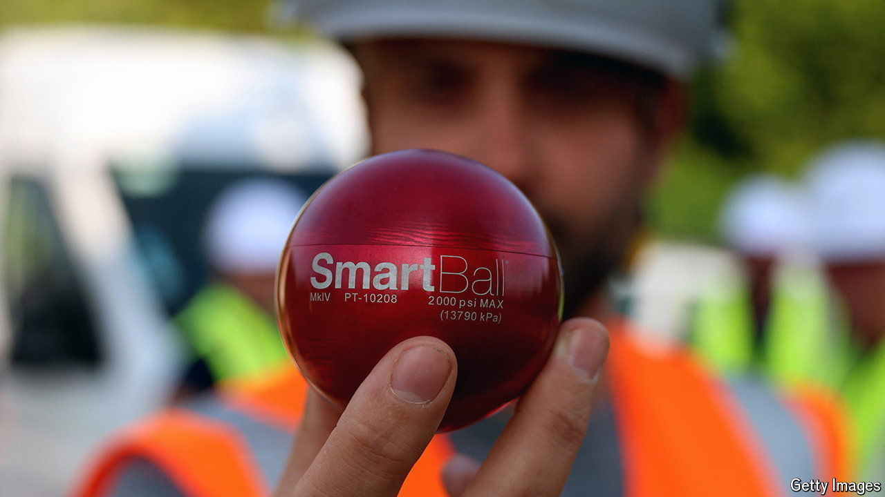

###### Water, water everywhere

# New technologies can spot pesky leaks in water pipelines 

##### Across Europe, nearly a quarter of water goes to waste 

 

> Sep 25th 2024 

IN JUNE, BLISTERINGLY hot temperatures and a prolonged dry spell plunged much of southern Italy into its worst drought in decades. Water shortages on glitzy Capri became so dire that local authorities temporarily banned ferries from offloading tourists on to the island. A lack of rainfall tells only half the story. Decrepit infrastructure is as much to blame, with over 40% of Capri’s drinking water seeping out through leaks in its pipe network before it reaches customers.

