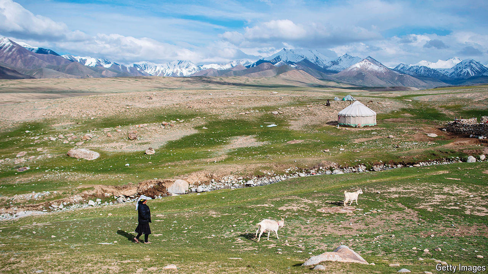

###### Extra extra mature

# The world’s oldest cheese sheds light on ancient Chinese culture 

##### What genetic analysis of a 3,500-year-old sour goat’s cheese from Xinjiang reveals 

 

> Sep 25th 2024 

FOR MORE than 3,500 years the mummified remains of the Xiaohe people lay undisturbed in a desert cemetery in Xinjiang in western China. Then, in 1979, a team of archaeologists got their hands on them. Among the treasures they dug up were mysterious white lumps strewn across the mummies’ necks: chunks of the oldest preserved cheese in the world.

