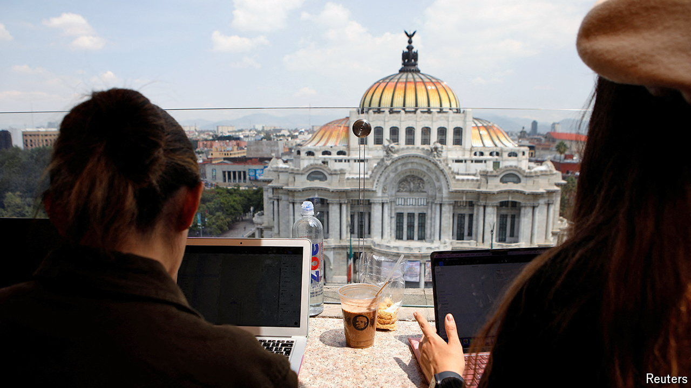

###### Remote workers

# Digital nomads are a force for good in Latin America 

##### It is unfair to blame remote workers for gentrifying neighbourhoods and raising rents 

 

> Sep 26th 2024 

In a café in Mexico City, Itandehui Ruíz rolls her eyes. Her  (fried tortilla chips in salsa) are missing something: spice. “The foreigners can’t handle it,” says a waiter. Some locals blame outsiders for diluting not only condiments but culture, and making life unaffordable. Mexico City was Latin America’s most expensive city in 2022 and 2023, according to the Economist Intelligence Unit, a sister company. 

