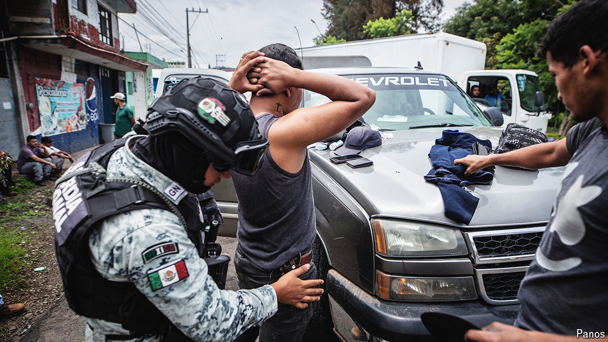

###### Mexican politics

# President Andrés Manuel López Obrador is militarising public security 

##### The latest constitutional reform will complicate the fight against drug gangs 

 

> Sep 26th 2024 

The Ayotzinapa case typifies Mexico’s law-and-order problems. In September 2014 in a town close to Mexico City, 43 trainee teachers were abducted and killed, with the involvement of government security forces. Yet a decade later President Andrés Manuel López Obrador, who once promised to resolve the case, has used his last month in power to push through a constitutional reform that will fully militarise federal forces. It bodes badly for both public safety and democracy. 

