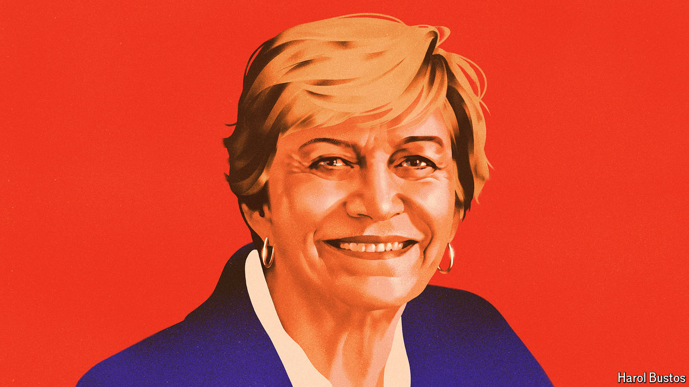

###### Evelyn Matthei

# The woman who will lead Chile’s counter-revolution 

##### Chileans tried youthful leftism. Now they want maturity and moderation 

 

> Sep 24th 2024 

The graffiti are still visible. Walls shout: “Death to the police!” Bus shelters demand: “No more private pensions!” Yet the occasionally  that rocked Chile from 2019 to 2022 is past. And the radical left-wing movement it propelled to power is now unpopular, having discovered that governing is harder than protesting. 

