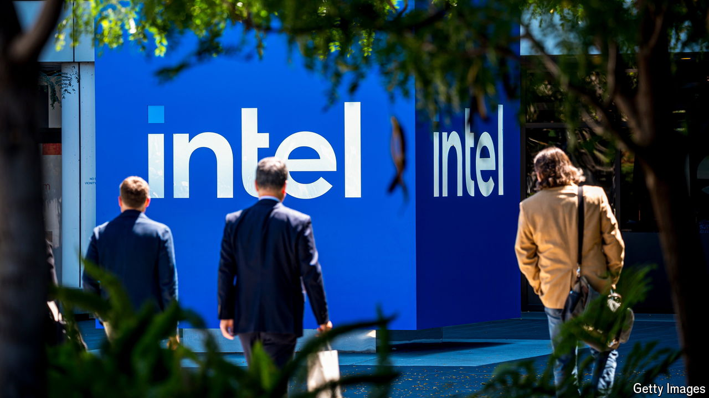

###### The world this week

# Business 

#####  

 

> Sep 26th 2024 

It emerged that  has  about a friendly takeover. Intel has fallen behind rivals such as Nvidia and AMD in the market for artificial-intelligence processors. In August a poor earnings report and tepid forecasts rattled investors, wiping $32bn off its market value. The company recently announced a turnaround plan, which focuses on turning its foundry business into an independent subsidiary. Intel’s share price rose on the news of Qualcomm’s offer, but the stock is still down by over 50% this year.

