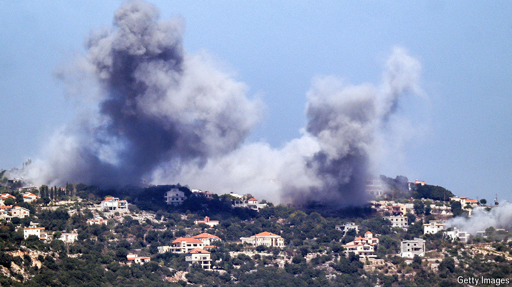

###### The world this week

# Politics 

#####  

 

> Sep 26th 2024 

Israeli troops were told to prepare for a  of , after  pounded operations in the south of the country. Lebanese officials said 600 people had been killed in the bombardment, but gave no breakdown of civilians and combatants. At the start of the campaign an Israeli strike killed 45 people in Beirut, including Ibrahim Aqil, a senior Hizbullah commander who was wanted for the bombings of the American embassy and marine barracks in Beirut in 1983. Hizbullah fired a ballistic missile at Israel for the first time. It was shot down over Tel Aviv. America and 11 of its allies called for a 21-day ceasefire.

