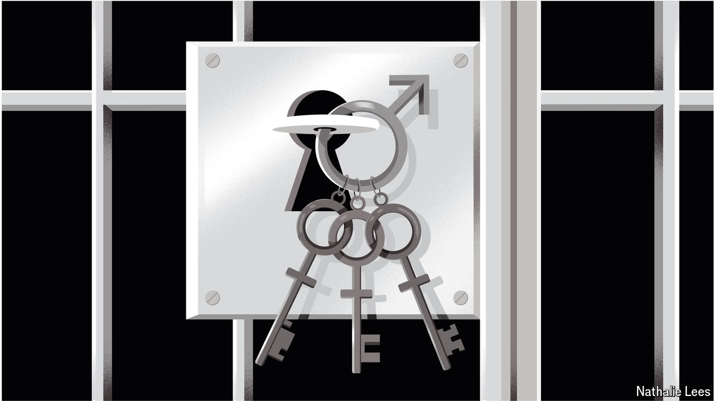

###### Hard cell

# America’s growing row over policies for transgender prisoners 

##### Some women’s groups argue that transferring them puts female inmates at risk 

 

> Sep 26th 2024 

In the spring of 2023 Jennifer Barela returned to her cell at the Central California Women’s Facility (ccwf) in Chowchilla to find “a large man” sitting there. Her new cellmate had been sentenced to life in prison in 1982 for murder, had changed name, self-identified as a woman and been transferred to ccwf. 

