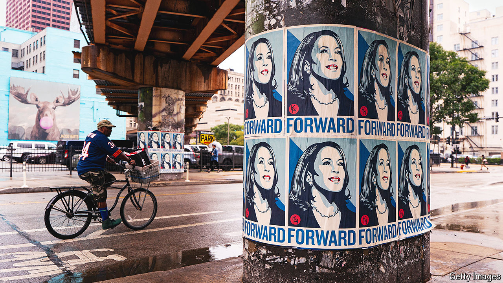

###### Money for nothing

# Kamala Harris is outspending Donald Trump. Will it matter? 

##### The Democratic nominee is raising many millions more than her opponent 

 

> Sep 26th 2024 

Campaign finance has changed dramatically over the past 15 years, but not in ways that many expected. The Supreme Court’s landmark decision in 2010, , enabled expansive corporate spending and ignited fears among Democrats that business-friendly Republicans would gain an irreversible advantage. “I don’t think American elections should be bankrolled by America’s most powerful interests,” Barack Obama warned. But two years later Mr Obama out-raised Mitt Romney while winning re-election. Political money rules kept easing, and Democrats kept benefiting. In 2016 Hillary Clinton enjoyed a nearly two-to-one advantage over Donald Trump, and Joe Biden easily out-raised Mr Trump four years ago in the most expensive campaign ever, at nearly $6bn.

