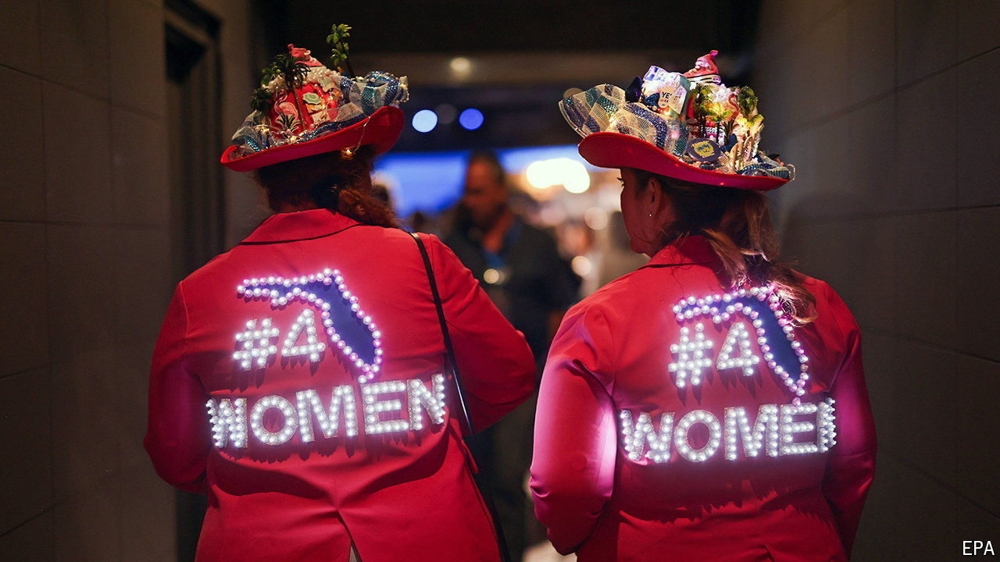

###### Direct democracy

# Kamalamania and the drive for abortion rights are a potent mix 

##### Referendums in ten states will determine the future of abortion access—and may tilt the presidential election 

 

> Sep 26th 2024 

ESTHER De Varona, a 77-year-old activist, wants her fellow to vote in November to enshrine a right to abortion in Florida, one of ten states holding a referendum this year on whether to make this part of their state constitution (see map). Ms De Varona and her group, Cuban American Women Supporting Democracy, have learned to stay away from phrases like “abortion rights” and to focus relentlessly on “the health of the woman”, she says. Polls suggest they are within striking distance of the 60% majority needed to pass the initiative in Florida. 

