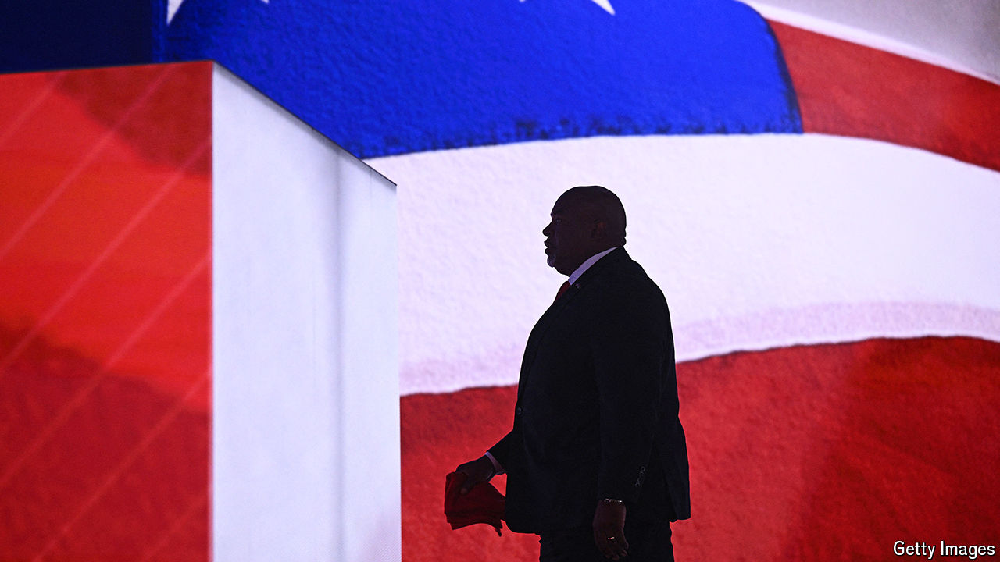

###### A little secret, the Robinson affair

# Mark Robinson has hijacked his own campaign in North Carolina 

##### Who will go down with the would-be Republican governor? 

 

> Sep 21st 2024 

“This is Martin Luther King on steroids,” Donald Trump told a crowd in North Carolina three days before Super Tuesday. Mark Robinson, the lieutenant-governor and Republican candidate for governor whom Mr Trump was endorsing, might not like that, he went on to say. Mr Robinson, who is black, had called King an “ersatz pastor” and the civil-rights movement the “Communist Rise Movement”. On September 19th CNN unearthed comments that make it even clearer that Mr Robinson—now the party’s nominee, with less than 40 days to the election—is no justice-loving preacher. Writing on Nude Africa, a porn site, he called himself a “black NAZI”, noted he wasn’t in the Ku Klux Klan because “they don’t let blacks join” and said that if they brought back slavery, which he wished they would, he would “certainly buy a few”. 

