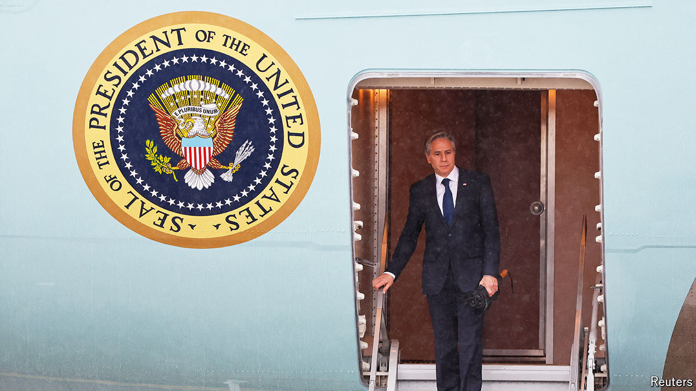

###### No longer showing up

# America is losing South-East Asia to China 

##### President Joe Biden will not attend this year’s East Asia Summit 

 

> Oct 3rd 2024 

Eight years ago Barack Obama spent several days in the twilight of his presidency in Laos. He bought a coconut from a roadside stall, visited holy sites, then sat through two days of stultifying summitry. But when Asian leaders once again convene in Laos on October 11th, President Joe Biden will not be there. He is skipping the East Asia Summit, an annual meeting of 18 countries, for the second year in a row. Antony Blinken (pictured), his secretary of state, will represent America instead. 

