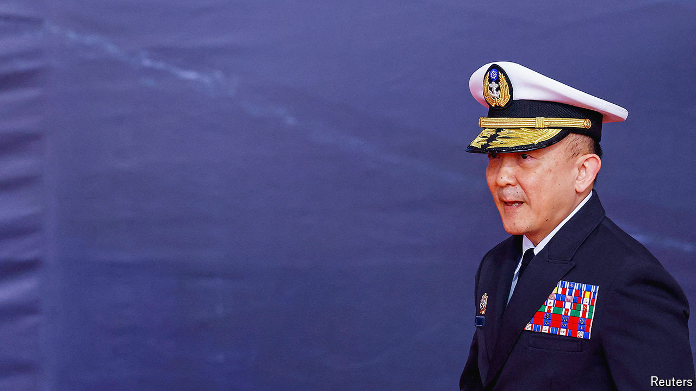

###### An interview with Admiral Tang Hua

# China is using an “anaconda strategy” to squeeze Taiwan 

##### Taiwan’s navy commander warns that his forces are increasingly strained 

 

> Oct 3rd 2024 

China’s dislike of Taiwan’s president Lai Ching-te is no secret. Chinese authorities call him a stubborn, confrontational “separatist” who may provoke war in the Taiwan Strait. But since Mr Lai’s election in May, it is China’s People’s Liberation Army (PLA) that has been raising the chances of conflict by deploying more air and naval craft around Taiwan. “The PLA is using an ‘anaconda strategy’ to squeeze the island,” says Admiral Tang Hua, Taiwan’s navy commander.

