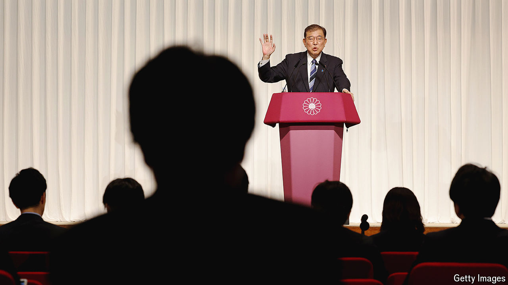

###### The outsider otaku

# Japan’s new prime minister is his own party’s sternest critic 

##### This could make it harder for Ishiba Shigeru to govern effectively 

 

> Oct 1st 2024 

ISHIBA SHIGERU, , knows what his colleagues think of him. “I have undoubtedly hurt many people’s feelings, caused unpleasant experiences and made many suffer,” he said apologetically in his final speech during the  of the ruling Liberal Democratic Party (LDP). Throughout his 38 years in parliament, Mr Ishiba has been a gadfly. That outspokenness endeared him to voters, but made him an outsider within the LDP. His first four leadership bids failed. Someone like him could win only if the LDP faced a major “roadblock” and “divine will” intervened, Mr Ishiba wrote in a book published this summer. 

