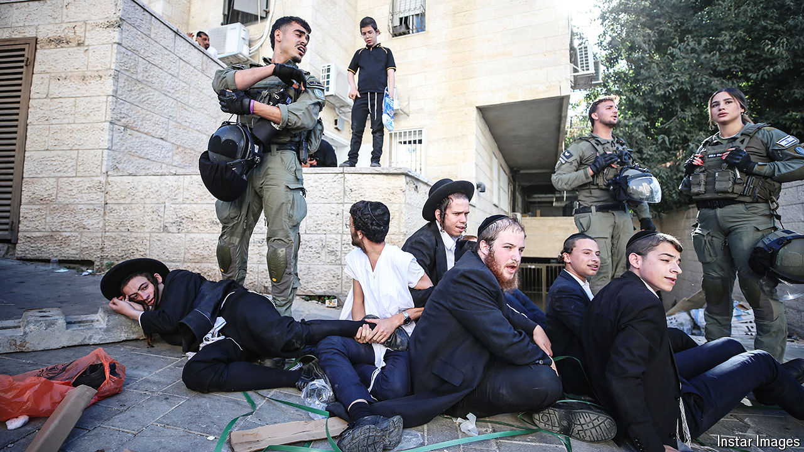

###### No common purpose

# A year on, Israeli society is divided about the lessons of October 7th 

##### Hawks and doves, religious and secular, right and left—all the old cleavages are resurfacing 

 

> Oct 3rd 2024 

“WE HAVE RESTORED deterrence,” declares Amos Yadlin, a former head of Israel’s military-intelligence service, referring to the credibility Israel’s security services lost on October 7th, 2023, when Palestinian radicals ran rampage across southern Israel, killing more than 1,100 people and kidnapping some 250. This has been regained by Israel’s devastating assault on Hizbullah, a Lebanese militant group that has been bombarding northern Israel for the past year, displacing some 60,000 civilians. In just two weeks Israel has killed and injured many Hizbullah operatives using booby-trapped pagers and walkie-talkies, assassinated several of its leaders in bombing raids and sent troops into southern Lebanon to destroy the tunnels, bases and rocket-launchers Hizbullah has been using in its attacks.

