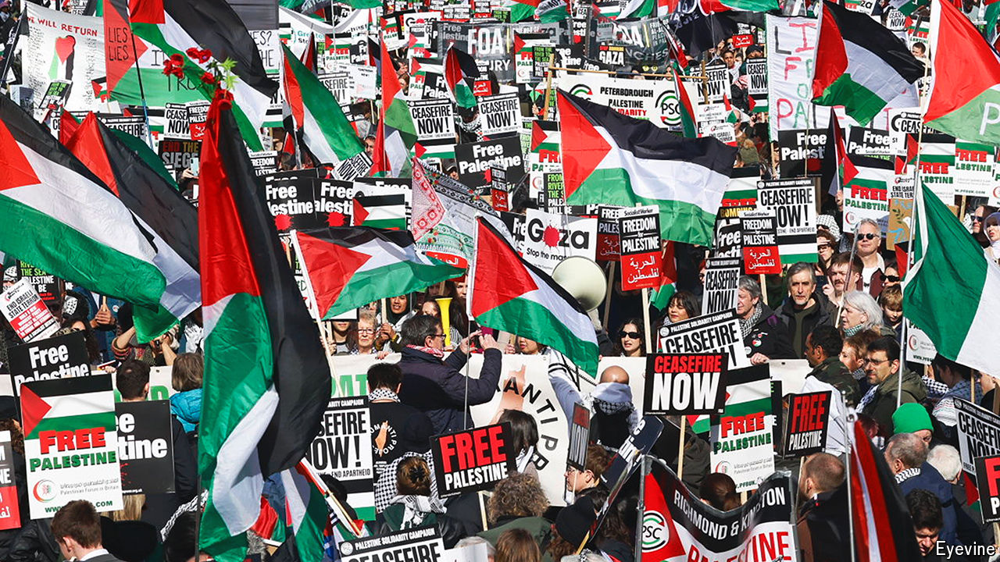

###### The Palestinians’ future

# Has the war in Gaza radicalised young Palestinians? 

##### After Gaza, how will the Palestinians try to build their state? 

 

> Oct 3rd 2024 

Among the banks, law firms and luxury hotels of central London, a piece of Palestine is rising. Born in an adjacent falafel joint, Palestine House has spread over five floors. Each depicts a different period of Palestinian history. The walls of one recreate the wooden latticework of a traditional inner courtyard; another, the smashed rubble of Gaza. Palestinian flags and banners protesting against genocide decorate the walls and pavement outside. By the end of the year Osama Qashoo, its founder, plans to open a journalists’ club, a radio station, a startup hub, an exhibition hall and a cultural salon in the building. “Each bomb Israel drops on Gaza is an amplifier,” says Mr Qashoo, an exile from the West Bank city of Nablus: “We are the carriers making sure Palestine’s story lives.”

