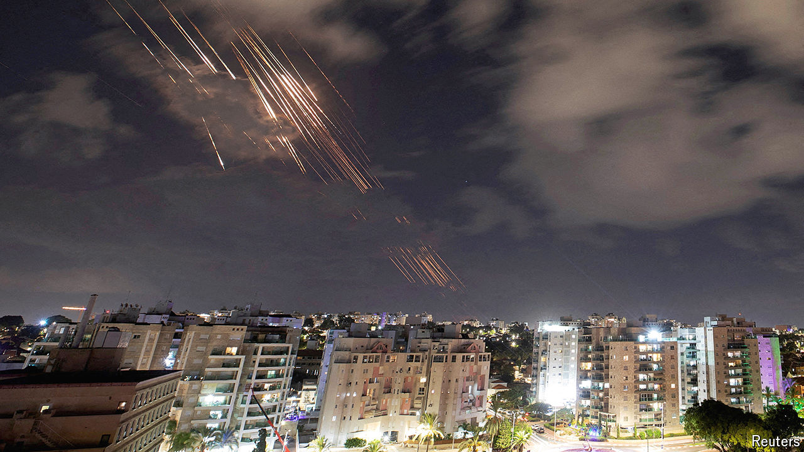

###### On many fronts

# The bloodshed in the Middle East is fast expanding 

##### Israel seems certain to retaliate to Iran’s missile attack 

 

> Oct 3rd 2024 

JEWS TRADITIONALLY mark the new year by eating an apple dipped in honey, an expression of hope that sweet times lie ahead. As Israeli families prepared to ring in the year 5785 on the evening of October 2nd, many must have hoped that it would at least be less bitter than 5784, which began with an atrocity. On October 7th 2023 Hamas, a militant Palestinian movement based in Gaza, burst through barriers walling Gaza off from Israel, massacred more than 1,100 people and took a further 250 hostage. During the year that has followed, Israel has not only fought non-stop with Hamas in Gaza, but also exchanged rockets with Iraq, Lebanon, Syria and Yemen. As the year drew to an end, on September 30th, it sent troops across the border into Lebanon, to battle Hizbullah, a Lebanese militia that has been bombarding northern Israel. The next day Iran, a patron of both Hamas and Hizbullah, launched a salvo of 181 missiles at Israel. As  went to press, the region was awaiting the inevitable Israeli riposte. Israel is now fighting wars on several fronts, with no end in sight to any of them.

