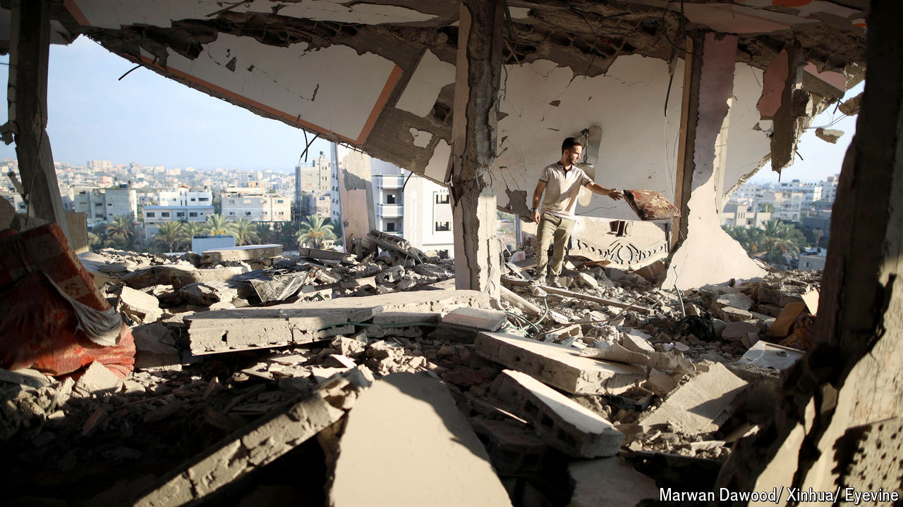

###### The great mistake

# What Hamas misunderstood about the Middle East 

##### A war meant to draw in the militant group’s allies has instead left them battered 

 

> Oct 2nd 2024 

PERHAPS IN HIS final days he reflected on the irony. Last year  had not been eager to start a war with Israel. Hizbullah’s leader felt dragged into it by Yahya Sinwar, the head of Hamas in Gaza, who had declined to consult his allies before his men attacked Israel on October 7th. But Nasrallah joined the war anyway: his own rhetoric left him little choice. Almost a year later, that decision would cost him his life.

