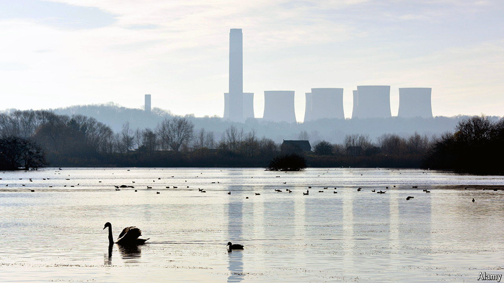

###### Burning ambition

# Britain’s last coal-fired power station closes 

##### The end of an era 

 

> Sep 29th 2024 

On September 30th water vapour will rise from the eight giant cooling towers at Ratcliffe-on-Soar in Nottinghamshire for the final time. The closure of Britain’s last coal-fired power plant is the end, in effect, of an industry that has played a critical role in shaping the country’s economy over three centuries. It is also testament to a remarkably successful drive to stamp down on the  of carbon emissions. 

