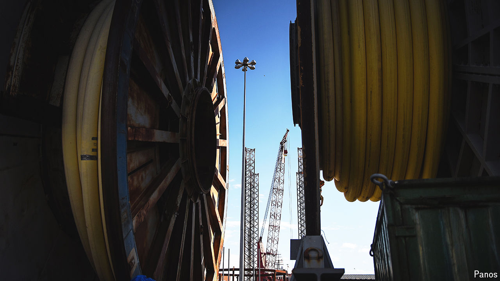

###### Blyth spirit

# Gigafactories and dashed dreams: the parable of Blyth 

##### What one port town says about the British economy 

 

> Oct 3rd 2024 

The little port town of Blyth in north-east England holds up a mirror to the British economy. For much of the 20th century it was a home to heavy industry. By the 1960s it was exporting more coal than anywhere else in Europe and had built the Royal Navy’s first aircraft-carrier. In the 1970s it was importing the raw materials needed by the smelting furnace a short train ride away. Then, as the collieries, shipyards and metalworks all closed, the town spent decades in decline. Its long search for a new act has made it a crucible for the policies of the previous Tory government and the new Labour one.

