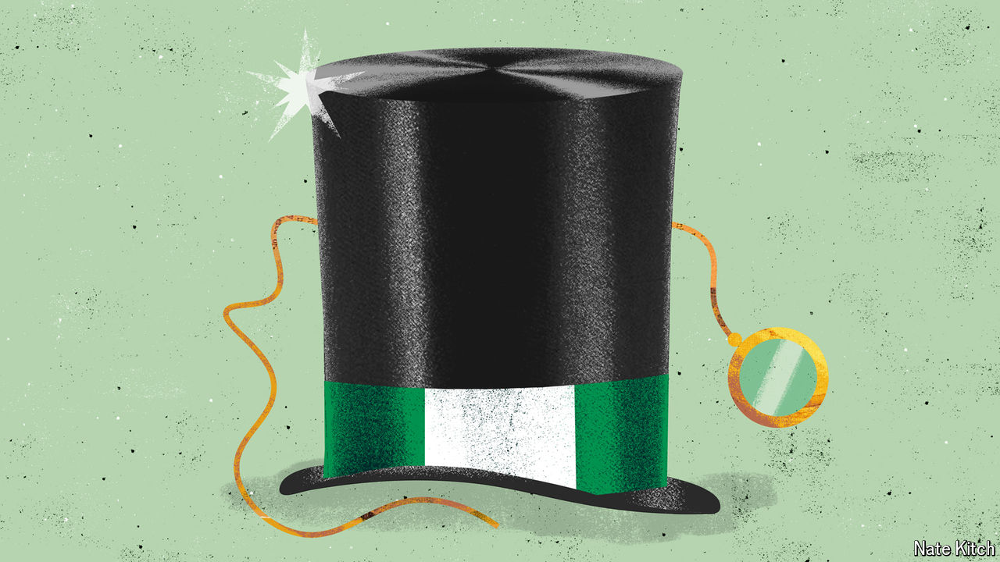

###### Bagehot

# How British-Nigerians quietly made their way to the top 

##### A story of modern migration has had extraordinary results 

 

> Oct 2nd 2024 

At Akoko, an upscale restaurant in central London, Nigerian staples such as moi-moi, a stodgy bean pudding, and mosa, a savoury doughnut made from overripe plantain, become fine dining. Staff shuttle steaming bowls of  across the restaurant to clients paying £120 ($160) for a tasting menu, plus another £95 for a wine pairing. (A shorter £55 lunch menu exists for the time-pressed, the tightwads and those husbanding expense accounts.) This year Akoko won its first Michelin star. It was joined by Chishuru, another Nigerian joint. Its owner, Adejoké Bakare, has gone from being a have-a-go chef working out of a temporary spot in Brixton Market in south London to a Michelin-star-winning West End mainstay in barely four years. 

