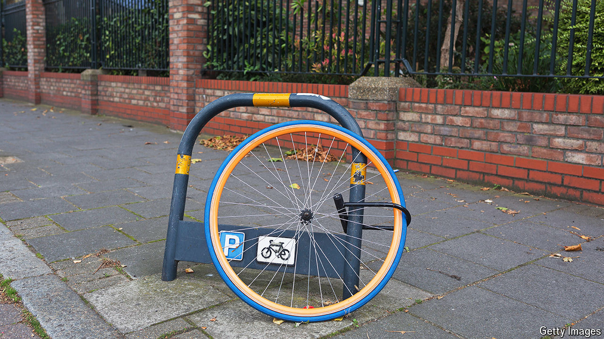

###### The wheels of justice

# The scourge of stolen bikes in Britain 

##### An experiment in Liverpool shows how the police can tackle bike theft 

 

> Sep 30th 2024 

ON A SUMMER’S day in Southport, in north-west England, the Merseyside police were on the hunt for stolen bikes. Their suspicions were raised by a “well-known male”, recently out of prison, on a notably pricey bicycle. Officers stopped him, entered the bike’s details into a database and rang the owner, who had been under the impression his bike was locked up outside his workplace. It had been recovered before he’d realised it had gone. 

