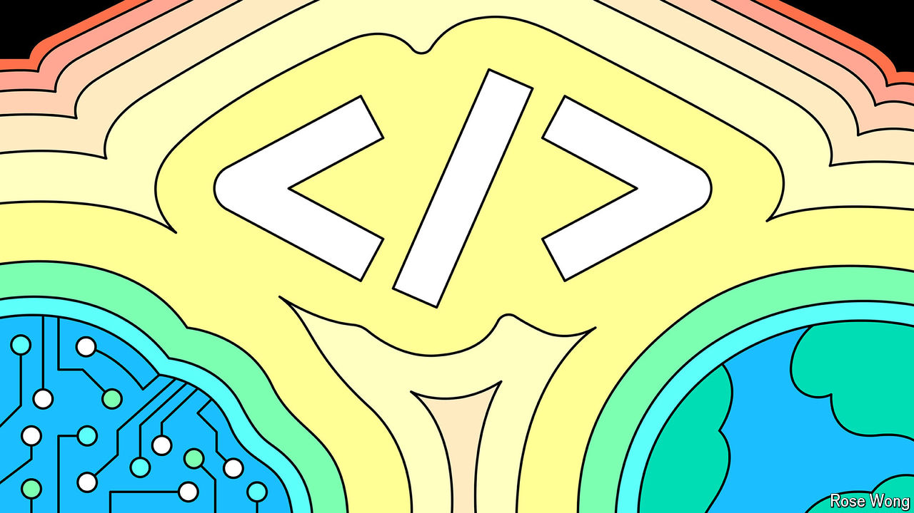

###### Changing the program

# AI and globalisation are shaking up software developers’ world 

##### Their code will get cheaper. So might they 

 

> Sep 29th 2024 

Two big shifts are under way in the world of software development. Since the launch of Chatgpt in 2022, bosses have been falling over themselves to try to find ways to . Most efforts have yielded little, but one exception is programming. Surveys suggest that developers around the world find generative ai so useful that already about two-fifths of them use it.

