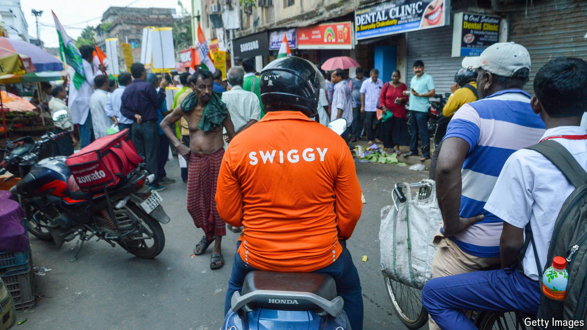

###### Instantaneous consumption

# India’s consumers are changing how they buy 

##### A giant population turns to deliveries 

 

> Oct 3rd 2024 

The gridlocked streets of India’s big cities are not blocked to everything. Tiny scooters laden with packages slip past cars, jump traffic lights and bounce over what pavements exist. Goods range from a tub of ice cream or a handful of pomegranate seeds to a coffee pot or even an iPhone. Such two-wheeled delivery services have taken off over the past four years, often promising to bring items in ten minutes in cities where it can take that time to cross a busy street.

