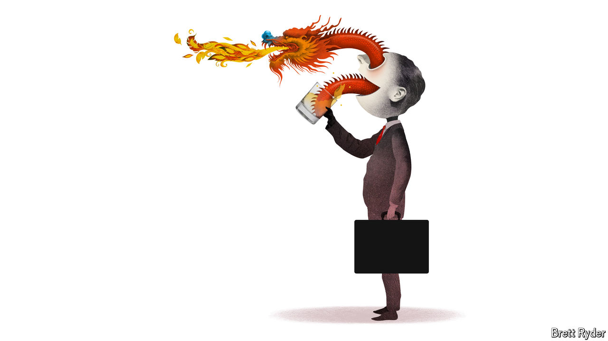

###### Schumpeter

# The future of the Chinese consumer—in three glasses 

##### What China’s biggest distiller, brewer and water-bottler say about its economy 

 

> Oct 1st 2024 

TO WESTERN PALATES  is an acquired taste—and most never acquire it. China’s national fire water, at first whiff redolent of cheap potato vodka with a  of fish sauce, is just too pungently unfamiliar. But whatever foreign investors plied with the stuff by their Chinese business partners make of the flavour, they appear to be lapping up shares in its makers. 

