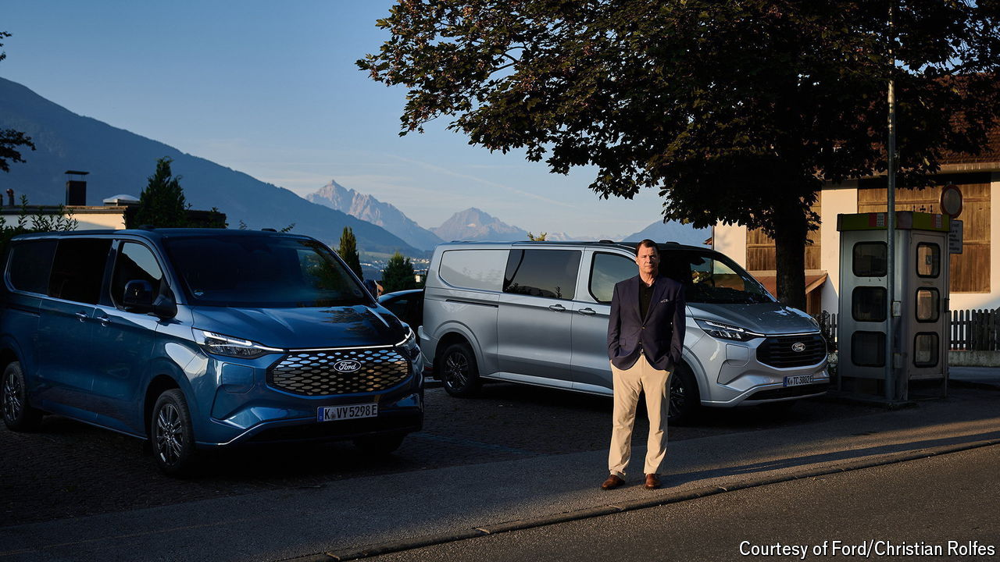

###### Road trip

# Transit vans are the key to Ford’s future 

##### And they earn big profits today 

 

> Oct 3rd 2024 

It is hard to imagine a place where Jim Farley, boss of Ford, might feel more comfortable discussing his company’s future than at the wheel of one of his firm’s vehicles. Mr Farley, pictured, whose driving skills have been honed racing Ford Mustangs in his spare time, fields questions with the same assurance that he pilots a Transit van down a winding Austrian mountain road. The three-day road trip in late August, from Ford’s European headquarters in Germany to Italy, in a convoy of four Transits, was arranged by Mr Farley to assess in detail one of the firm’s best-selling vehicles as well as to meet dealers and customers along the way.

