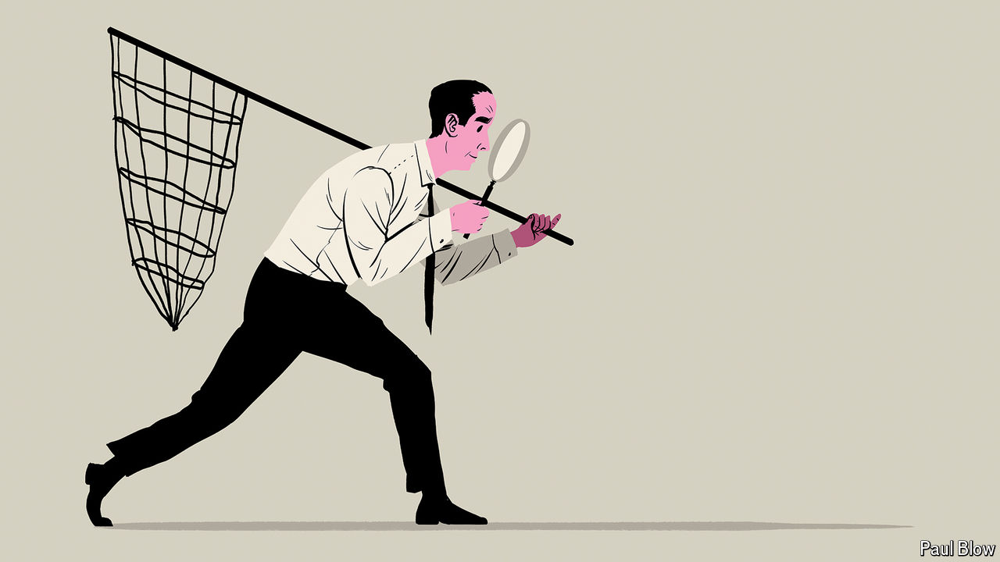

###### Bartleby

# What makes a good manager? 

##### Hint: not someone who says I am a good manager 

 

> Oct 3rd 2024 

The Ig Nobel awards, an annual ceremony for laugh-out-loud scientific papers, celebrate the joyfully improbable nature of much academic research. One of this year’s Ig Nobel winners, “Factors involved in the ejection of milk”, was published in 1941 and tests whether fear causes cows to involuntarily drain their udders. Its authors drew their conclusions by placing a cat on a cow’s back and repeatedly exploding paper bags beside it. “Genetic determinism and hemispheric influence in hair whorl formation”, another winner, asks whether hair tends to swirl in the same direction depending on which hemisphere you live in. 

